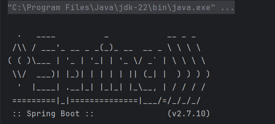
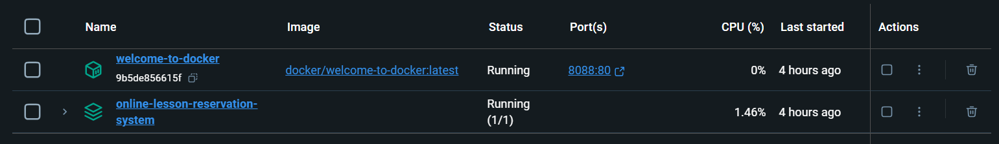
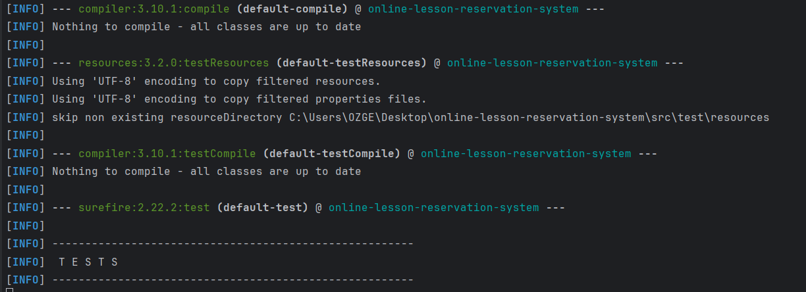

# Online Lesson Reservation System

## Proje Açıklaması

Online Lesson Reservation System, öğrenci ve öğretmenlerin çevrimiçi ders rezervasyonu yapmalarını sağlayan bir platformdur. Kullanıcılar, mevcut dersleri görüntüleyebilir, ders rezervasyonu yapabilir ve geçmiş rezervasyonlarını yönetebilir.

## Özellikler

- Kullanıcı kayıt ve oturum açma
- Öğrenciler için ders rezervasyonu
- Öğretmenler için ders ekleme ve yönetimi
- Kullanıcı rollerine göre yetkilendirme
- Swagger ile API dokümantasyonu

## Teknolojiler

- Spring Boot
- Spring Data JPA
- Spring Security
- H2 Database (veya tercih edilen diğer veritabanları)
- Swagger

## Kurulum

1. Projeyi klonlayın:

   ```bash
   git clone https://github.com/username/repo.git

# Online Lesson Reservation System

## Proje Açıklaması

Online Lesson Reservation System, öğrenci ve öğretmenlerin çevrimiçi ders rezervasyonu yapmalarını sağlayan bir platformdur. Kullanıcılar, mevcut dersleri görüntüleyebilir, ders rezervasyonu yapabilir ve geçmiş rezervasyonlarını yönetebilir.

## Özellikler

- Kullanıcı kayıt ve oturum açma
- Öğrenciler için ders rezervasyonu
- Öğretmenler için ders ekleme ve yönetimi
- Kullanıcı rollerine göre yetkilendirme
- Swagger ile API dokümantasyonu

## Teknolojiler

- Spring Boot
- Spring Data JPA
- Spring Security
- H2 Database (veya tercih edilen diğer veritabanları)
- Swagger

## Kurulum

1. Projeyi klonlayın:

   git clone https://github.com/username/repo.git 

2. Proje dizinine gidin:

   cd online-lesson-reservation-system

3. Maven bağımlılıklarını yükleyin:

   mvn install

4. Uygulamayı başlatın:

   mvn spring-boot:run

5. Swagger UI'ya erişin:

    Tarayıcınızda http://localhost:8088/swagger-ui/ adresini açın.

Kullanım

Öğrenci olarak oturum açın ve dersleri görüntüleyin.
İlgilendiğiniz dersi seçin ve rezervasyon yapın.
Rezervasyonlarınızı görüntüleyin ve yönetin.





